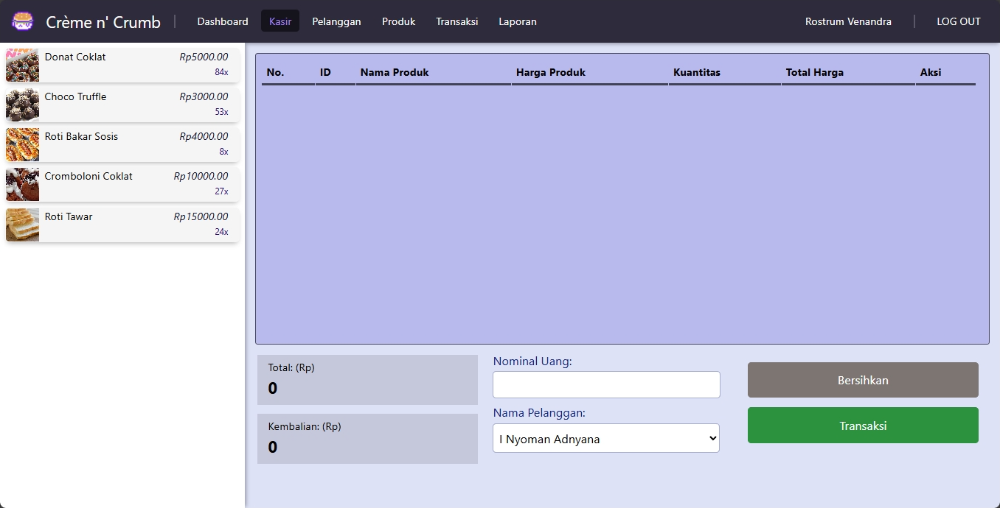

<h1 style="rotate: -20deg; margin-top: 1em;">ukk paket 3 nggawe kasir toko bakery</h1>
<br><br><br>

intine yo ngunu.

mboh gaween sakkarepmu. 

penting kowe eroh carane.

## carane ben iso nggawe nek proyek
kakno laragon opo xampp mu, penting php ne nyukupi <br>
nek gak salah php 8.2 ta php 8.4 ngunu mboh lali

**kudu enek:**
- node.js/npm
- composer
- xampp/laragon 6.x
- git
- php 8.2~an
- phpmyadmin (opsional)

---

kowe buka folder sekarepmu trus tekan nek cmd ta powershell ta bash ngunu, lebokno:
(lebokno siji siji, secara urut)

```
git clone https://github.com/r-danialf/bakeryukk

cd bakeryukk

composer i

npm i

php artisan key:generate
```

nggawe `.env` ne, njupuk teko `.env.example` trus ubahen seng 
sqlite dadi mysql, trus setting kabeh pengaturanne ben podo host
e, password, username, dll

```
php artisan migrate
```

nek gaiso jajalen `php artisan migrate:fresh`

trus enjoy ae aplikasi ne.
beda'no landing pagee soko kene dadi proyekmu ae

ngantuk

